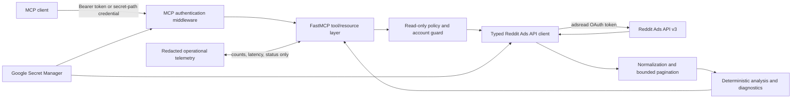

# Read-Only Reddit Ads MCP

## Combined product, security, implementation, and release plan

**Status:** Approved for implementation — full v1 tool scope and personal-use authentication approach selected; Phase 0 will validate Reddit redirect behavior  
**Date:** July 21, 2026  
**Deployment model:** Open-source software; each user deploys a private instance in their own Google Cloud project or runs it locally  
**Safety posture:** Permanently read-only

---

## 1. Executive decision

Build an open-source, analysis-first Model Context Protocol (MCP) server for Reddit Ads API v3. It will let an authorized advertiser inspect account structure, retrieve reports, diagnose delivery and tracking, analyze performance, and research available targeting without modifying anything in Reddit.

The implementation will combine:

- Claude's concise, advertiser-oriented tool design and phased delivery model.
- A stricter operation-level read-only policy derived from the supplied OpenAPI specification.
- Broader coverage for creatives, tracking, apps, SKAdNetwork, catalogs, delivery diagnostics, and deterministic analysis.
- Production-grade authentication, secret handling, output limits, tests, and Cloud Run deployment.
- A compliance and disclosure policy covering Reddit's restrictions on Ads API data and third-party AI providers without making a Reddit response a publication prerequisite.

The recommended implementation is Python 3.12 with the official MCP Python SDK and FastMCP. It will expose:

- **Streamable HTTP** for a private Google Cloud Run deployment.
- **stdio** for local MCP clients.
- The same tools and safety policy through both transports.

The repository will contain no advertiser credentials, access tokens, refresh tokens, or real advertising data. The maintainers will not operate a shared hosted service.

---

## 2. Non-negotiable principles

### 2.1 Permanently read-only

Read-only is a property of the program, not a deployment option.

- Request only Reddit's `adsread` OAuth scope.
- Never request, accept, document, or use `adsedit`, `adsconversions`, or `adsdatadeletion`.
- Do not implement create, update, delete, upload, pause, resume, budget, bid, targeting, audience-member, conversion-event, or deletion-job operations.
- Do not include an `enable-writes` flag or dormant write handlers.
- Do not provide a generic HTTP or arbitrary Reddit endpoint tool.
- Do not generate or ship write request models unless required transitively by a library; if generated, they must be inaccessible to application code and excluded from the operation registry.
- If a management MCP is ever desired, it must be a separate repository, OAuth application, deployment, and security review.

### 2.2 Analysis-first

The MCP should answer advertiser questions rather than reproduce the REST API one endpoint per tool.

Examples:

- “How did we perform this week compared with last week?”
- “Which creatives are driving purchases efficiently?”
- “Why did delivery stop?”
- “Did a budget, bid, status, or targeting change precede the CPA increase?”
- “Which communities, placements, geographies, or devices perform best?”
- “Is the conversion pixel still firing?”

### 2.3 Single advertiser per deployment

One deployment uses one Reddit OAuth installation and an explicit allowlist of permitted ad-account IDs.

- It may expose multiple accounts owned by the same authorized advertiser if they are all explicitly allowlisted.
- It must never act as a shared credential broker.
- It must never mix or benchmark data across unrelated advertisers.
- Account discovery does not automatically grant MCP access to every account returned by Reddit.

### 2.4 Minimal data retention

- No application database in the first release.
- No persistent cache of Reddit Ads API responses.
- Short-lived in-memory caches are allowed for entity-name joins, taxonomies, and OAuth access tokens.
- No report rows, audience metadata, campaign names, creative text, or click URLs in normal logs.
- Derived results are returned to the caller and then discarded.

### 2.5 Deterministic calculations, explicit interpretation

The server may perform arithmetic, aggregation, comparison, ranking, and rule-based diagnostics. Every derived value must identify its formula and inputs. The connected AI model may interpret those results, but the server must not disguise model-generated judgments as API facts.

---

## 3. Sources of truth and known API realities

### 3.1 Inputs reviewed

The design is based on:

- The supplied `openapi.json`, verified against Reddit's current downloadable v3 specification.
- SHA-256 of the supplied specification: `69a3fc9ca3869409da42342c6fb9b38db02ca4aef47e59b13bffe30caac22d44`.
- The supplied Reddit Ads API entity-relationship diagram.
- The supplied screenshot of Reddit's API introduction and terms page.
- Reddit's current Ads API documentation and changelog.
- Reddit's Ads API Terms and Developer Terms.
- The official MCP Python SDK documentation.
- Google Cloud Run and Secret Manager documentation.

The ERD is useful for understanding relationships, but it is not a complete capability map. The OpenAPI file contains substantially more fields, filters, report dimensions, and supporting endpoints.

### 3.2 Current API inventory

The supplied specification contains approximately:

- 74 paths
- 99 operations
- 26 tags
- 60 `GET`, 23 `POST`, 12 `PATCH`, and 4 `DELETE` operations

Several legitimate read-like operations use `POST`, including reporting and suggestions. Therefore, “GET only” would be too restrictive, while “scope says adsread” would be too permissive.

### 3.3 Specification inconsistencies that affect design

The implementation must account for at least these inconsistencies:

- `PATCH Update Saved Audience` is annotated with `adsread` in the specification. It is still a write and must never be allowed.
- `GET List Communities Suggestions` lacks a security annotation. The MCP will still require its own authentication and classify it manually.
- Reddit's June 2026 changelog introduces name-based `conversion_custom_events`, while the downloadable OpenAPI request schema appears to lag behind.
- Some examples and enums do not perfectly agree.

The OpenAPI document is a contract and drift-detection input, not an automatic security policy.

### 3.4 Reporting facts to encode

The current report schema exposes hundreds of selectable field enums and 20 breakdowns:

- `AD_ACCOUNT_ID`
- `CAMPAIGN_ID`
- `AD_GROUP_ID`
- `AD_ID`
- `DATE`
- `HOUR`
- `COUNTRY`
- `REGION`
- `DMA`
- `METRO`
- `COMMUNITY`
- `INTEREST`
- `KEYWORD`
- `PLACEMENT`
- `OS_TYPE`
- `GENDER`
- `LANGUAGE`
- `CAROUSEL_CARD`
- `GALLERY_ITEM_ID`
- `ASSET_ID`

Important rules:

- A report supports up to three breakdowns, or four in the documented country-plus-region case.
- Metrics can take up to six hours to stabilize.
- Delivery data is available for up to 24 months.
- Reach and frequency data begin in June 2024.
- Reporting defaults to UTC unless `time_zone_id` is supplied.
- Several spend, cost, app, and conversion fields require different scaling rules.
- Upvotes, downvotes, and comments are not present in the current report field enumeration.
- `ENGAGED_CLICK` and `REDDIT_LEADS` are present.
- Numbered custom-conversion slots are deprecated; name-based custom events are the forward-looking interface.

### 3.5 Upcoming and recent changes to support

- `conversion_pixel_id` became required for all ad groups and campaign-budget-optimization campaigns on July 13, 2026. This is a write-side requirement, but it is useful in diagnostics.
- New objective enums are scheduled for September 21, 2026.
- The Lead Generation Forms API is scheduled to sunset on September 21, 2026, with existing onsite-form ads paused on September 30, 2026. Historical read endpoints may remain useful.
- Creative Assets and Structured Posts now have useful public read endpoints.
- Name-based custom conversion events and the `LANGUAGE` report breakdown were added in June 2026.

---

## 4. Read-only security contract

### 4.1 Exact operation allowlist

Create a version-controlled `ReadOperationRegistry`. Each entry contains:

- OpenAPI operation ID
- Exact HTTP method
- Exact templated path
- Required Reddit scope
- Rate-limit policy group
- Pagination behavior
- Maximum page size
- Data-sensitivity classification
- Whether the operation is enabled, optional, legacy, or experimental

An outgoing Reddit request is rejected unless the method and normalized path match an enabled entry. Redirects are disabled by default.

The initial registry may include:

- Safe entity and taxonomy `GET` operations.
- The exact reports `POST` operation.
- Exact read-like forecasting, reach, bid, keyword, and geolocation-validation operations where required.

It will never include:

- Any `PATCH`, `PUT`, or `DELETE` operation.
- Conversion event ingestion.
- Audience-member ingestion.
- Data-deletion endpoints.
- Creation-job endpoints.
- Any generic passthrough.

### 4.2 Defense in depth

| Layer | Control |
|---|---|
| Reddit OAuth | Request and verify only `adsread`. |
| MCP authentication | Require either the default bearer-token mode or the explicitly enabled high-entropy secret-path compatibility mode. The modes are mutually exclusive. |
| Account isolation | Require `ALLOWED_ACCOUNT_IDS`; reject every other account. |
| Operation registry | Match exact method and path before every Reddit request. |
| Tool surface | Expose no arbitrary method, URL, or operation ID. |
| HTTP client | Allow only approved HTTPS Reddit hosts; disable arbitrary redirects. |
| Pagination | Validate every returned `next_url` host, scheme, and path family. |
| Tests | Fail if forbidden methods or write operation IDs become reachable. |
| CI drift check | Require manual classification of new or changed OpenAPI operations. |
| Runtime configuration | No setting can enable writes. |

### 4.3 Account authorization

- `ALLOWED_ACCOUNT_IDS` is mandatory for Cloud Run.
- `DEFAULT_ACCOUNT_ID` may be set only if it is in the allowlist.
- Every tool validates its resolved account before contacting Reddit.
- Business, member, profile, and funding lookups are limited to what is necessary to resolve or diagnose an allowed account.
- Member email addresses and unnecessary personal fields are omitted from output by default.

---

## 5. Intended users and supported workflows

### Primary users

- An advertiser analyzing their own Reddit campaigns.
- An agency deploying a separate instance/configuration for each authorized client environment.
- An analyst using a local MCP connection.
- A developer operating a private Cloud Run deployment.

### Primary workflows

1. Discover the authorized account hierarchy.
2. Review current and historical campaigns, ad groups, ads, targeting, and creatives.
3. Generate flexible reports across supported metrics and breakdowns.
4. Compare periods and rank entities.
5. Diagnose tracking, delivery, rejection, and configuration problems.
6. Correlate account changes with performance changes.
7. Analyze creative, video, conversion, app, community, placement, and geographic performance.
8. Inspect available targeting, reach estimates, bids, keywords, saved audiences, and feature access.
9. Review commerce catalog health when relevant.

---

## 6. MCP capability design

The final count is less important than keeping the tools coherent and easy for an AI client to choose. The target is approximately 25 composable tools plus a small set of reference resources and optional prompts.

### 6.1 Account structure and creative context

| Tool | Purpose | Important inputs | Important outputs |
|---|---|---|---|
| `list_ad_accounts` | Discover accounts available to the authorized user, filtered to the configured allowlist. | Optional business ID; pagination. | Account ID, name, currency, timezone, attribution settings, configured default. |
| `list_campaigns` | Inspect campaigns and filter by status, objective, name, or date. | Account, configured/effective status, objective, search, pagination. | Budget/spend-cap metadata, objective, schedule, funding reference, delivery status. |
| `list_ad_groups` | Inspect ad groups and complete targeting configuration. | Account, campaign IDs, statuses, search, pagination. | Bid, budget, optimization, schedule, conversion pixel, targeting, delivery status. |
| `list_ads` | Inspect ads and delivery/review state. | Account, campaign/ad-group IDs, status, search, pagination. | Format, creative/post references, destination, preview, status, rejection reason. |
| `get_creative_context` | Resolve an ad into creative assets and structured-post details for analysis. | Account and one or more ad IDs. | Creative type, text metadata, asset metadata, destination domain, carousel/gallery structure, preview, review state. |
| `get_account_history` | Find configuration changes that may explain performance changes. | Date range; member, change type, entity ID/name filters; include children. | Actor ID/display label, timestamp, entity, changed area, before/after values where available. |

Implementation notes:

- `list_ad_accounts` may use business discovery internally, but it returns only allowlisted accounts.
- `get_creative_context` uses read-only Ads, Creative Assets, and Structured Posts operations.
- User-generated creative text is marked as untrusted external data, never as MCP instructions.
- Account history redacts member email addresses unless a future, explicitly reviewed need justifies them.

### 6.2 Reporting and deterministic analysis

| Tool | Purpose |
|---|---|
| `get_report` | Flexible access to Reddit reporting with validated fields, breakdowns, filters, timezone, attribution, and pagination. |
| `get_daily_performance` | Opinionated daily KPI preset for a recent period. |
| `compare_periods` | Compare two equivalent periods and return absolute and percentage deltas. |
| `rank_performance` | Rank campaigns, ad groups, ads, creatives, communities, placements, or another supported dimension. |
| `analyze_trends` | Produce daily/hourly trend series, moving comparisons, and simple anomaly flags. |
| `analyze_pacing` | Compare spend and results with elapsed campaign/ad-group schedule and known budget information. |
| `analyze_conversions` | Summarize conversion funnel, attribution mix, CPA, conversion value, and ROAS. |
| `analyze_video` | Summarize views, watch milestones, completion, sound-on behavior, drop-off, and video costs. |
| `analyze_creatives` | Join ad/asset context with performance and rank creative characteristics. |

#### `get_report` inputs

- `account_id` — optional only when a valid default is configured.
- `starts_at` and `ends_at` — explicit ISO dates/times.
- `time_zone_id` — defaults to account timezone, then UTC if unavailable.
- `breakdowns` — validated against the current supported list and combination rules.
- `metric_groups` — compact curated groups such as core, video, conversion, value, app, SKAN, or custom events.
- `fields` — optional explicit Reddit fields for advanced users.
- `conversion_metrics` — action-source filters when supported.
- `custom_conversion_events` — preferred name-based selection.
- `legacy_custom_conversion_slots` — compatibility only, with a warning.
- `custom_column_ids` — optional Ads Manager custom columns.
- `filters` — curated entity and conversion filters only.
- `max_rows` and `max_pages` — bounded by server-configured ceilings.

Do not place all hundreds of report fields directly in the MCP tool schema. That would consume excessive model context. Provide a report-field resource and perform authoritative validation in the server.

#### Reporting calculations

- Prefer Reddit-provided CTR, CPC, CPM/eCPM, CPV, CPA, frequency, and ROAS when available.
- When calculated locally, return the formula and label the field as derived.
- Handle zero denominators as `null`, not infinity or zero.
- Preserve source values and scaling provenance.
- Distinguish currency micros, conversion-value cents, and other documented scaling rules.
- Mark recent, potentially unstable dates.
- Do not imply causation from correlation or account-history timing.

### 6.3 Health and diagnostics

| Tool | Purpose | Coverage |
|---|---|---|
| `get_tracking_health` | Determine whether conversion tracking appears active. | Pixels, pixel event `last_fired_at`, apps, app event health, SKAdNetwork availability where accessible. |
| `diagnose_delivery` | Explain why an entity may not be serving or spending. | Configured/effective/delivery statuses, rejection, processing, permissions, schedule, tracking association, feature access, zero-delivery report checks. |
| `list_custom_audiences` | Audit available audience metadata without accessing members. | Type, status, delivery status, approximate size range, relevant configuration summary. |
| `get_catalog_health` | Diagnose commerce catalog and feed problems. | Catalogs, product sets, import status, invalid/rejected/approved counts, import summaries. |

Composite tools must use bounded concurrency and return partial-result warnings if a subordinate endpoint fails.

### 6.4 Targeting and forecasting

| Tool | Purpose |
|---|---|
| `search_targeting` | Unified lookup for communities, interests, geography, devices, carriers, languages, and supported audience taxonomies. |
| `get_community_suggestions` | Retrieve Reddit's suggestions from supported names/topics and website URL inputs. |
| `get_reach_estimate` | Retrieve the supported reach/impression estimate for a targeting scenario. |
| `get_bid_suggestions` | Retrieve Reddit's suggested bid information for a scenario. |
| `get_keyword_suggestions` | Retrieve Reddit's keyword targeting suggestions. |
| `get_feature_access` | Determine whether account/business/pixel-specific gated features are available. |
| `get_saved_audiences` | Inspect reusable targeting templates without modifying them. |

The reach tool must communicate current input restrictions rather than implying arbitrary forecasting. The supplied specification currently limits important parameters including supported duration windows, countries, ages, and gender values.

### 6.5 Legacy read capability

`list_lead_gen_forms` may be included as a legacy/historical tool or folded into a resource. It must be clearly marked with Reddit's September 2026 sunset dates and must never expose submitted lead data.

### 6.6 MCP resources

Expose stable reference material without making the model call tools for every definition:

- `reddit-ads://capabilities` — supported and deliberately unsupported operations.
- `reddit-ads://account-hierarchy` — Business → Ad Account → Campaign → Ad Group → Ad → Creative/Post.
- `reddit-ads://report-fields` — field names, groups, units, scaling, availability, and deprecation state.
- `reddit-ads://report-breakdowns` — breakdown definitions and combination limits.
- `reddit-ads://freshness-and-attribution` — stabilization, timezone, attribution, and historical limits.
- `reddit-ads://configured-accounts` — sanitized list of allowed accounts and the default.
- `reddit-ads://api-compatibility` — known current API/OpenAPI mismatches and upcoming migrations.
- `reddit-ads://security-and-privacy` — data-handling and prohibited-use summary.

### 6.7 Optional MCP prompts

Prompts can make common workflows repeatable without granting additional access:

- `weekly_performance_review`
- `diagnose_performance_drop`
- `creative_performance_review`
- `tracking_health_review`

Prompts should instruct the client to use evidence from tools, disclose incomplete data, and separate observations from recommendations.

---

## 7. Common input and output contract

### 7.1 Common inputs

- Account ID resolves from an explicit argument or a configured default.
- All account IDs are checked against the allowlist.
- Date ranges require explicit bounds after defaults are resolved.
- Pagination uses opaque cursors or server-controlled `max_pages`; users cannot supply arbitrary `next_url` values.
- Sorting, filtering, and search parameters are enumerated or tightly validated.
- Tool inputs have maximum string, array, ID-count, and date-range sizes.

### 7.2 Common response envelope

Every tool returns MCP `structuredContent` with a predictable envelope:

```json
{
  "data": [],
  "summary": {},
  "meta": {
    "account_id": "...",
    "currency": "USD",
    "time_zone": "America/New_York",
    "pages_fetched": 1,
    "rows_returned": 25,
    "truncated": false,
    "next_page_available": false,
    "source": "Reddit Ads API v3"
  },
  "warnings": [],
  "derived_metrics": []
}
```

The accompanying text content should be a compact human-readable summary, not a duplicate of every row.

### 7.3 Default output limits

Initial recommended server ceilings:

- 90-day default maximum report range per call; configurable downward or upward within a documented absolute ceiling.
- 1,000 rows and 10 pages by default.
- 100 entity IDs per request.
- 10 subordinate requests per composite tool unless explicitly raised by the operator.
- Bounded response size before MCP serialization.

When a limit is reached, return `truncated: true` and explain how to narrow or continue the request. Never silently discard rows or claim a result is complete when it is capped.

### 7.4 Personal-use execution safeguards

The default distribution targets one owner making a small number of requests each week. It must protect against an AI client accidentally repeating a tool call or expanding one question into an excessive number of upstream requests.

Recommended hard application ceilings for the personal-use profile:

- 60 MCP tool calls per rolling hour per authenticated owner.
- 20 Reddit API subrequests per MCP tool call.
- 4 concurrent Reddit API requests within a composite tool.
- 90-second application deadline per tool call.
- 120-second Cloud Run request timeout.
- 1,000 report rows and 10 pages per tool call, with lower defaults where practical.
- 90-day default report range and a separately documented absolute maximum.
- 100 entity IDs per request.
- 2 MiB maximum serialized MCP response unless a future client requirement justifies more.
- Brief duplicate-request suppression for identical calls received in rapid succession.

Limits are enforced by the server and cannot be raised through MCP tool arguments beyond operator-configured ceilings. Every rejection must explain which limit was reached and how to narrow the request.

The rolling-hour limiter may initially be in memory because Cloud Run is restricted to one maximum instance for personal use. It is a protection against accidental client loops, not an accounting or security ledger. A persistent cross-instance quota service is unnecessary unless a future deployment supports multiple users or instances.

---

## 8. Architecture



### 8.1 Components

1. **Configuration layer**
   - Validates secrets, allowlists, safe limits, user agent, and transport settings at startup.

2. **MCP authentication middleware**
   - Protects the remote MCP endpoint using one mutually exclusive mode: bearer token by default, or an explicitly enabled secret-path compatibility credential for clients that cannot attach headers.

3. **FastMCP server**
   - Registers tools, resources, prompts, input schemas, and structured outputs.

4. **Read-only policy engine**
   - Validates the exact outgoing operation and authorized account.

5. **Reddit OAuth manager**
   - Exchanges refresh tokens for short-lived access tokens and verifies the granted scope.

6. **Reddit API client**
   - Adds authorization and compliant user agent, implements timeouts, policy-aware rate limits, retries, error mapping, and safe pagination.

7. **Entity resolver**
   - Batches and caches ID-to-name lookups to avoid N+1 calls.

8. **Normalization layer**
   - Applies currency units, dates, null handling, enum compatibility, and provenance.

9. **Analysis layer**
   - Performs deterministic comparison, ranking, aggregation, pacing, and diagnostic rules.

10. **Transport entry points**
   - Stateless Streamable HTTP for Cloud Run and stdio for local execution.

### 8.2 Stateless Cloud Run operation

- FastMCP configured for stateless HTTP and JSON responses.
- No dependence on sticky sessions.
- Access-token cache is per container instance and can be regenerated from the refresh token.
- In-memory taxonomy/entity caches may differ across instances without affecting correctness.
- No persistent MCP session state is required.

---

## 9. Authentication and secret setup

There are two independent authentication boundaries.

### 9.1 Reddit authentication

Secrets:

- `REDDIT_CLIENT_ID`
- `REDDIT_CLIENT_SECRET`
- `REDDIT_REFRESH_TOKEN`

Configuration:

- `REDDIT_USER_AGENT`
- `ALLOWED_ACCOUNT_IDS`
- `DEFAULT_ACCOUNT_ID`, optional

The user agent follows Reddit's documented pattern and identifies the actual app, version, and Reddit username. Generic browser impersonation is forbidden.

The OAuth manager:

- Requests only `adsread`.
- Rejects a token response that does not include the expected scope.
- Stores access tokens only in memory.
- Refreshes before expiry using a lock so concurrent calls do not trigger a refresh storm.
- Never logs tokens or OAuth response bodies.

### 9.2 MCP client authentication

Authentication mode:

- `MCP_AUTH_MODE=bearer` — default and recommended.
- `MCP_AUTH_MODE=secret_path` — optional compatibility mode for a private, single-owner deployment and MCP clients that cannot attach an authorization header.

The modes are mutually exclusive. Startup fails if the selected mode is missing its credential, if credentials for both modes are made active, or if the configured value is unsupported.

Secrets:

- `MCP_ACCESS_TOKEN` in bearer mode.
- `MCP_PATH_SECRET` in secret-path mode.

#### Bearer mode

Remote requests use:

`Authorization: Bearer <MCP_ACCESS_TOKEN>`

Only `/mcp` serves MCP traffic. Missing or incorrect bearer credentials are rejected. Token comparison is constant-time.

#### Secret-path compatibility mode

- The setup process generates at least 32 random bytes and encodes them safely for a URL. The operator does not choose a memorable path.
- Only `/<MCP_PATH_SECRET>/mcp` serves MCP traffic.
- `/mcp`, incorrect paths, path prefixes, and near matches return `404` without revealing whether the service or credential exists.
- The path secret is the credential; no bearer header is required in this mode.
- It is stored in Secret Manager and never in source control, container layers, Terraform state output, shell history, screenshots, or public documentation.
- Rotation creates a new Cloud Run revision and invalidates the previous URL.
- Documentation must state that the credential can appear in the MCP client's connector settings, browser history, reverse-proxy telemetry, and Cloud Run infrastructure request logs. Application logs must never emit it.
- This mode is supported only because the service is personal, single-owner, permanently read-only, account-allowlisted, rate-limited, and bounded for cost and output. It is not represented as equivalent to standards-based OAuth.

#### Requirements in both modes

- No query-string credentials.
- Health endpoints disclose no configuration or secret status beyond healthy/unhealthy.
- CORS disabled unless a documented browser client requires narrowly scoped origins.
- All account, tool-call, upstream-request, pagination, timeout, response-size, and cost safeguards remain active.
- A Google IAM-only alternative may be documented for clients capable of supplying Google identity tokens.

### 9.3 OAuth bootstrap flow

Phase 0 must first test whether the current Reddit Ads developer-application interface accepts a localhost redirect URI.

If localhost is accepted, the preferred flow is:

1. User creates or selects their Reddit developer application.
2. A local setup command generates an authorization URL and random `state` value.
3. The browser grants only `adsread`.
4. A temporary local callback receives and validates the code/state.
5. The setup command exchanges the code and confirms the returned scope.
6. The refresh token is added to Secret Manager through the user's authenticated Google CLI session.
7. Temporary local OAuth state is deleted.

If localhost is rejected, a one-time public HTTPS callback on Cloud Run becomes the primary documented flow. It is permissible only if:

- It requires a separate one-time setup secret.
- It validates state.
- It exchanges the code server-side.
- It never displays the code or refresh token.
- It automatically disables itself after success.
- A short-lived setup identity may add exactly one version to the designated Reddit refresh-token secret; that write permission is revoked immediately after successful setup.
- The normal runtime service account retains only Secret Manager read access and cannot replace credentials.

---

## 10. Reddit client behavior

### 10.1 Pagination

- Follow Reddit's returned `pagination.next_url`; never reconstruct it from assumed query parameters.
- Accept only HTTPS.
- Accept only the configured Reddit Ads API hostname.
- Reject embedded credentials, fragments, unexpected ports, or path families outside the current operation.
- Detect repeated URLs/cursors and stop pagination loops.
- Enforce page, row, time, and response-size caps.

### 10.2 Rate limits

- Parse current `RateLimit` and `RateLimit-Policy` headers.
- Track each policy slug independently rather than assuming one global 60-request budget.
- Apply proactive throttling when remaining quota is low.
- On `429`, wait according to the server's policy/reset indication, bounded by the MCP request deadline.
- Expose a warning when a response is partial because the deadline or rate budget was reached.

### 10.3 Retries and failures

Retry with capped exponential backoff and jitter:

- `429`
- Eligible transient `5xx`
- Network connection resets/timeouts when the request is safe to repeat

Do not retry automatically:

- `400` validation failures
- `401` after one controlled token refresh
- `403` scope/permission failures
- `404`
- Policy or account-allowlist rejections

Map errors into concise, actionable MCP errors without echoing secrets or complete upstream response bodies.

### 10.4 Compatibility handling

- Centralize enum aliases and known API/OpenAPI discrepancies.
- Unknown response fields are preserved where safe rather than causing total failure.
- Unknown enums become an explicit `UNKNOWN:<raw>` representation or retain the raw value.
- Request parameters remain strict to prevent accidental unsupported behavior.
- Name-based custom conversions are preferred; legacy numbered slots emit deprecation warnings.

---

## 11. Security and privacy threat model

| Risk | Mitigation |
|---|---|
| Accidental campaign mutation | No write operations, no write scopes, exact operation registry, CI invariant tests. |
| Stolen Reddit credentials | Secret Manager, least-privilege service account, no logs, rotation guide. |
| Unauthorized MCP caller | Bearer authentication by default; explicit high-entropy secret-path compatibility mode for a private single-owner deployment; TLS, rotation, rate limits, and optional IAM where supported. |
| Cross-account access | Mandatory account allowlist checked on every tool and subordinate request. |
| SSRF through pagination URLs | Scheme/host/path validation, redirects disabled, cycle detection. |
| Data leakage through logs | Structured logging allowlist; never log payloads, names, creative text, URLs, or tokens. |
| Excessive disclosure to the AI provider | Summary-first output, row/date/page limits, explicit user-selected detail. |
| Prompt injection in ad/creative names or text | Mark upstream strings as untrusted data; never interpret them as tool instructions. |
| Denial of service or cost amplification | Request-size limits, concurrency bounds, timeouts, quotas, Cloud Run max instances. |
| Supply-chain compromise | Locked dependencies, automated vulnerability scanning, minimal container image, provenance/SBOM where practical. |
| Sensitive audience data | Metadata only; no audience member upload/download; approximate sizes only where returned. |
| OAuth callback theft | State validation, one-time callback, immediate exchange, no displayed tokens/codes. |

### Logging policy

Allowed operational fields:

- Request ID
- Tool name
- Duration
- Success/error category
- Reddit status code
- Number of pages/rows, not row contents
- Rate-limit policy name and remaining numeric quota
- Cache hit/miss

Forbidden log content:

- Tokens and secrets
- Authorization headers
- OAuth codes
- Full request/response bodies
- Account, campaign, ad-group, ad, member, pixel, audience, or creative names
- Click/destination URLs
- Report rows
- Member emails

---

## 12. Google Cloud Run deployment

### 12.1 Recommended resources

- Dedicated Google Cloud project where practical.
- Artifact Registry repository for the container.
- Dedicated Cloud Run service account.
- Secret Manager secrets for Reddit credentials and MCP access token.
- Cloud Run service.
- Optional Cloud Logging alerting based only on sanitized operational data.

### 12.2 Least-privilege service account

The runtime service account should have:

- Secret Manager Secret Accessor only for the specific required secrets.
- Permission to write standard Cloud Run logs, without payload logging.
- No project Editor or Owner role.
- No database, storage, or unrelated Google API permissions.

### 12.3 Recommended initial Cloud Run settings

- Minimum instances: `0`
- Maximum instances: `1` for the personal-use profile; operators must make an explicit, documented change to raise it
- Concurrency: `5` for the personal-use profile, adjusted only after testing
- Request timeout: sufficient for bounded reports, with an application deadline shorter than the platform timeout
- Memory: start at 512 MiB or 1 GiB depending on generated-model footprint
- CPU: 1 vCPU initially
- Container listens on the platform-provided `PORT`
- Application runs as a non-root user
- No writable application filesystem requirement
- MCP endpoint: `/mcp` in bearer mode or `/<secret>/mcp` in secret-path compatibility mode
- Separate minimal `/healthz` endpoint

The Cloud Run service may be network-accessible for MCP client compatibility. In bearer mode, `/mcp` requires the bearer token. In secret-path mode, the high-entropy path is the credential and the normal `/mcp` path returns `404`. The service never exposes an uncredentialed MCP endpoint. A Google IAM-only alternative should be documented for compatible clients.

### 12.4 Deployment paths

Provide both:

1. A beginner-oriented `gcloud` guide with explicit commands and explanations.
2. Terraform for reproducible projects, service accounts, secrets, Artifact Registry, and Cloud Run configuration.

The guide must never ask users to put secrets into a Docker build argument, checked-in `.env` file, GitHub Actions output, or command that will expose them in normal logs.

### 12.5 Personal-use cost guardrail profile

The default Google Cloud deployment must be intentionally constrained so normal personal use remains within Google's free allowances and an accidental loop cannot scale horizontally.

Required defaults:

- Cloud Run request-based billing.
- Minimum instances: `0`.
- Maximum instances: `1`.
- 1 vCPU and 512 MiB memory initially.
- Container concurrency: `5` initially.
- CPU allocated only while processing requests; no always-on CPU.
- Application and platform timeouts as defined in section 7.4.
- No Cloud SQL, Firestore, Memorystore, Serverless VPC Access connector, external load balancer, Cloud Armor, or paid OAuth provider in the default deployment.
- Default Cloud Run HTTPS hostname; no custom domain is required.
- Only compact operational logs; never log request or response payloads.
- Standard log retention with no long-term analytics export.
- Artifact Registry cleanup policy retaining the newest three images and deleting untagged/obsolete images after 30 days.
- Cloud Build runs manually or on tagged releases; do not create an unrestricted build-on-every-push loop in a personal project.
- Keep no more than six active Secret Manager versions across the deployment where practical. Destroy obsolete credential versions after rotation has been verified; merely disabling a version may continue to count it as active.

Billing protections:

- Require a dedicated Google Cloud project so its costs are easy to identify.
- Create a small monthly Cloud Billing budget, recommended at USD 5 or the local-currency equivalent.
- Send alerts at a fixed USD 1 threshold and at 50%, 90%, and 100% of the monthly budget.
- State prominently that Google Cloud budget alerts are notifications, not hard spending caps.
- Document an emergency command that removes external access or scales the service out of use if an alert is unexpected.
- Apply consistent labels such as `application=reddit-ads-mcp` and `environment=personal` to billable resources.

Cost expectations for the personal-use profile:

- Normal use once or twice per week should ordinarily result in a USD 0 Google Cloud bill.
- Artifact storage or extra active secret versions may create charges measured in cents.
- A bill above a few dollars should be treated as an operational anomaly and investigated.

The deployment guide must include a short monthly check covering Cloud Run billable instance time, Artifact Registry storage, active secret versions, log ingestion, and unexpected resources.

---

## 13. Repository design

Proposed structure:

```text
reddit-ads-insights-mcp/
├── src/reddit_ads_mcp/
│   ├── app.py
│   ├── config.py
│   ├── auth/
│   │   ├── mcp_bearer.py
│   │   ├── reddit_oauth.py
│   │   └── bootstrap.py
│   ├── reddit/
│   │   ├── client.py
│   │   ├── operations.py
│   │   ├── pagination.py
│   │   ├── rate_limits.py
│   │   ├── models/
│   │   └── compatibility.py
│   ├── policy/
│   │   ├── read_registry.py
│   │   ├── accounts.py
│   │   └── limits.py
│   ├── tools/
│   │   ├── accounts.py
│   │   ├── reporting.py
│   │   ├── analysis.py
│   │   ├── creatives.py
│   │   ├── diagnostics.py
│   │   ├── targeting.py
│   │   └── catalogs.py
│   ├── analysis/
│   │   ├── metrics.py
│   │   ├── comparison.py
│   │   ├── ranking.py
│   │   ├── pacing.py
│   │   └── diagnostics.py
│   ├── resources/
│   └── transports/
│       ├── http.py
│       └── stdio.py
├── tests/
│   ├── unit/
│   ├── contract/
│   ├── security/
│   ├── integration/
│   └── fixtures/
├── openapi/
│   ├── reddit-ads-v3.json
│   ├── SHA256SUMS
│   └── compatibility-overrides.yaml
├── deploy/
│   ├── terraform/
│   └── gcloud/
├── docs/
│   ├── ARCHITECTURE.md
│   ├── AUTHENTICATION.md
│   ├── DEPLOY_GCP.md
│   ├── SECURITY.md
│   ├── DATA_HANDLING.md
│   ├── TERMS_CHECKLIST.md
│   └── TROUBLESHOOTING.md
├── scripts/
│   ├── bootstrap_oauth.py
│   ├── check_openapi_drift.py
│   └── verify_read_only.py
├── .env.example
├── Dockerfile
├── pyproject.toml
├── uv.lock
├── LICENSE
├── SECURITY.md
└── README.md
```

### Naming and branding

Use a descriptive community-project name such as **Ads Insights MCP for Reddit**. Do not use Reddit logos or wording that implies Reddit created, sponsored, certified, or endorsed the project. Include a prominent unofficial-project disclaimer.

---

## 14. Test and verification strategy

### 14.1 Unit tests

- Metric scaling and normalization
- Null and zero-denominator behavior
- Date/timezone and daylight-saving boundaries
- Period comparison formulas
- Ranking and pacing calculations
- Enum compatibility
- Account allowlist resolution
- Output truncation metadata
- Error sanitization

### 14.2 Read-only invariant tests

- Enumerate every registered operation and assert it matches the approved registry.
- Assert no registered operation uses `PATCH`, `PUT`, or `DELETE`.
- Assert no conversion ingestion, audience upload, data deletion, or creation operation is reachable.
- Scan source for forbidden operation IDs and paths.
- Assert OAuth configuration contains only `adsread`.
- Start the MCP and verify the published tool list contains no mutation semantics.

### 14.3 Contract tests

- Validate curated request/response models against the pinned OpenAPI file.
- Confirm every operation registry entry still exists with the expected method/path.
- Detect newly added or changed API operations.
- Detect report field, breakdown, enum, and parameter changes.
- Maintain explicit compatibility tests for `conversion_custom_events` until the specification and live API agree.

### 14.4 HTTP and resilience tests

- Pagination success, truncation, repeated cursor, malicious host, HTTP URL, unexpected redirect
- Rate-limit header parsing for multiple policies
- `429` timing and capped retry behavior
- Token-refresh concurrency and one-time `401` recovery
- Partial composite-tool failures
- Deadlines, response-size limits, and oversized inputs

### 14.5 Security tests

- Unauthorized and malformed MCP bearer tokens
- Cross-account access attempts
- Header, query, and log secret leakage
- Prompt-like strings in campaign and creative names
- Path normalization and encoded pagination URL attacks
- CORS and host-header behavior
- Health endpoint information disclosure
- Bearer mode rejects missing and incorrect tokens and never enables the secret path.
- Secret-path mode rejects `/mcp`, incorrect paths, prefixes, and near matches with `404` and never enables bearer mode concurrently.
- Secret-path generation provides at least 256 bits of entropy and rotation invalidates the previous path.
- Application logs, errors, health output, and deployment output never contain either MCP credential.

### 14.6 Cost and runaway-execution tests

- Verify the published Cloud Run configuration has zero minimum and one maximum instance.
- Verify request-based billing and no always-on CPU configuration.
- Verify the rolling-hour tool-call limiter and subordinate-request ceiling.
- Verify composite tools cannot exceed concurrency, page, row, response-size, or deadline ceilings.
- Verify duplicate-call suppression does not return another account's cached result.
- Verify oversized or repeated requests fail cheaply before Reddit pagination begins.
- Verify Artifact Registry cleanup policy and restrained build triggers are present in deployment artifacts.
- Verify the Terraform and `gcloud` paths create budget alerts and resource labels.
- Verify no default database, VPC connector, load balancer, Cloud Armor policy, or paid identity dependency is provisioned.

### 14.7 Integration tests

- Sanitized recorded fixtures for CI
- MCP protocol tests through stdio and Streamable HTTP
- MCP Inspector smoke tests
- Optional live Reddit tests requiring a separately configured test advertiser account
- Live tests disabled by default and never run on pull requests from forks

### 14.8 Release verification

- Build container reproducibly.
- Scan dependencies and image.
- Run as non-root.
- Deploy to a clean test Google Cloud project using the published guide.
- Complete OAuth bootstrap without manually copying a refresh token through an insecure web page.
- Connect at least one supported MCP client.
- Verify bearer mode with a header-capable client and secret-path compatibility mode with a URL-only remote connector.
- Run representative reporting, diagnostic, creative, and targeting workflows.
- Verify logs contain no Reddit Ads data or credentials.
- Deliberately trigger application limits and confirm the service fails closed without creating additional instances.
- Review the clean-project cost estimate and confirm only the documented resources exist.

---

## 15. Terms, privacy, and release policy

This section is operational guidance, not legal advice.

### 15.1 Repository policy

- Publish software and synthetic fixtures only.
- Never publish actual advertiser data, tokens, IDs, screenshots, report output, audience metadata, or creative content in the repository.
- Provide a security reporting process.
- Provide data-handling and deletion guidance.
- Require users to review Reddit's current Ads API Terms, Developer Terms, Advertising Platform Terms, and applicable privacy obligations.

### 15.2 Important terms questions

Single-tenancy reduces risk but does not automatically settle every contractual issue. The MCP sends selected Ads API results to the AI provider chosen by the deployer. Reddit's current terms restrict disclosure and use of Ads API data in ways that may apply to hosted AI services.

Publication is not contingent on Reddit answering a pre-publication clarification request. The maintainers may seek clarification or App Review in parallel, and must document and comply with any response or requirement Reddit provides. A non-response does not by itself block publishing source code and synthetic fixtures. The existence of other open-source clients is not evidence of Reddit approval or legal compliance.

Documentation must describe the hosted-AI-provider uncertainty honestly, require each deployer to assess their own agreements and permissions, and never claim Reddit approval, endorsement, review, or guaranteed compliance. If Reddit requests App Review or directs the maintainers to change distribution or behavior, the project will cooperate and make the necessary changes.

### 15.3 Required usage boundaries

Documentation must prohibit or warn against:

- Sharing one deployment or token across unrelated advertisers.
- Publishing Ads API results to third parties.
- Using real data in public issues or support discussions.
- Combining Ads API data with Reddit Data API data without explicit permission.
- Training machine-learning or AI models on returned data without necessary permissions.
- Attempting to reidentify, profile, or extract individuals.
- Persisting more data than necessary.
- Using the project to evade rate limits, app review, feature gates, or Reddit policies.

### 15.4 Release gates

Private development and testing can proceed with the operator's authorized account. Public release requires:

- Terms and privacy documentation completed.
- No-write invariant demonstrated in CI.
- Security review completed.
- Cloud Run deployment reproduced from a clean project.
- All fixtures confirmed synthetic or irreversibly sanitized.
- Terms documentation explains the third-party-provider uncertainty and any known Reddit response or review status without overclaiming.
- No claim of Reddit endorsement.

---

## 16. Implementation phases and acceptance criteria

### Phase 0 — Specification and policy freeze

Deliverables:

- Approved tool catalog and non-goals.
- Versioned read-operation registry.
- Pinned OpenAPI snapshot and checksum.
- Compatibility-override mechanism.
- Data classifications and default output limits.
- Terms checklist and optional clarification/App Review request template; sending it is not a publication prerequisite.

Acceptance criteria:

- Reddit Ads developer-app localhost redirect support has been tested. If unsupported, the protected one-time Cloud Run callback and temporary Secret Manager write-permission flow is the primary documented bootstrap.
- Every planned upstream operation is manually classified.
- No mutation path is included.
- Reporting claims match the supplied specification and current changelog.

### Phase 1 — Foundation and private MVP

Deliverables:

- Python project, dependency lock, and minimal container.
- Configuration validation.
- Reddit OAuth bootstrap and refresh.
- Safe typed client, pagination, rate limiting, retries, and errors.
- MCP authentication middleware with mutually exclusive bearer and secret-path compatibility modes.
- stdio and stateless Streamable HTTP transports.
- `list_ad_accounts`, `list_campaigns`, `list_ad_groups`, `list_ads`.
- `get_report` and `get_daily_performance`.

Acceptance criteria:

- Works locally and in a private Cloud Run test deployment.
- Uses only `adsread`.
- Rejects non-allowlisted accounts.
- No Reddit response data appears in logs.
- Read-only invariant tests pass.

### Phase 2 — Analysis and creative context

Deliverables:

- `compare_periods`
- `rank_performance`
- `analyze_trends`
- `analyze_pacing`
- `analyze_conversions`
- `analyze_video`
- `get_creative_context`
- `analyze_creatives`
- `get_account_history`

Acceptance criteria:

- Every derived metric includes provenance/formula.
- Entity joins avoid uncontrolled N+1 requests.
- Recent-data and incomplete-result warnings are accurate.
- Creative strings remain treated as untrusted data.

### Phase 3 — Diagnostics and extended read coverage

Deliverables:

- `get_tracking_health`
- `diagnose_delivery`
- `list_custom_audiences`
- `get_catalog_health`
- Targeting, community, reach, bid, keyword, feature, and saved-audience tools
- Optional historical lead-form inventory
- Reference resources and optional prompts

Acceptance criteria:

- Composite calls respect concurrency and rate budgets.
- Partial failures are visible without losing successful results.
- No custom audience members or lead submissions are accessible.

### Phase 4 — Deployment and operator experience

Deliverables:

- Production Dockerfile.
- `gcloud` deployment guide.
- Terraform module/example.
- Secret Manager integration.
- OAuth setup walkthrough.
- MCP client examples.
- Sanitized observability and troubleshooting guidance.
- Personal-use cost guardrail profile, Artifact Registry cleanup, and billing alerts.
- Emergency shutoff instructions and a lightweight monthly cost checklist.

Acceptance criteria:

- A new user can deploy from a clean Google Cloud project without placing a secret in Git or image layers.
- The remote endpoint rejects unauthenticated requests.
- Scale-to-zero and cold-start behavior are tested.
- The deployment has zero minimum and one maximum Cloud Run instance by default.
- Accidental repeated calls are bounded by application rate, subrequest, pagination, concurrency, timeout, and response-size limits.

### Phase 5 — Open-source readiness

Deliverables:

- README, architecture, security, data-handling, terms, contributing, and troubleshooting documentation.
- License and unofficial-project disclaimer.
- CI for tests, linting, types, dependency scanning, image scanning, and read-only verification.
- Scheduled OpenAPI and changelog drift report.
- GitHub release process.
- MCP Registry metadata only when release gates permit it.

Acceptance criteria:

- Clean external security review or documented internal threat-model review.
- Public repository contains no real Ads API data.
- Any known Reddit clarification/App Review position is documented without overclaiming; a non-response is not treated as approval.
- Deployment instructions have been independently reproduced.

---

## 17. Explicitly out of scope

The following will not be built into this repository:

- Campaign, ad-group, ad, creative, post, saved-audience, catalog, pixel, or account mutations
- Status, budget, bid, schedule, or targeting changes
- Conversion event ingestion or Conversions API support
- Custom audience member upload, download, or inspection
- Reddit data-deletion jobs
- Lead submission retrieval
- Billing instruments beyond minimal read-only servability/currency context when necessary
- A shared multi-tenant hosted service
- Cross-advertiser benchmarking
- Comment-text or sentiment retrieval
- Reddit Data API enrichment
- Competitor scraping or undocumented endpoints
- An unrestricted raw API proxy
- A database or long-term reporting warehouse
- Automated AI recommendations that are represented as Reddit-provided facts

---

## 18. Approved implementation decisions

Proceed with these defaults unless a verified implementation constraint requires a documented amendment:

1. **Language:** Python 3.12.
2. **MCP framework:** Official Python MCP SDK/FastMCP.
3. **Remote transport:** Stateless Streamable HTTP with JSON responses.
4. **Local transport:** stdio.
5. **Hosting:** User-owned Google Cloud Run only; maintainers do not host a shared service.
6. **Reddit OAuth:** `adsread` only. Local bootstrap is preferred only if Phase 0 verifies localhost redirect support; otherwise use the protected one-time Cloud Run callback.
7. **Remote MCP auth:** Mutually exclusive modes: bearer token from Secret Manager by default, or an explicitly enabled high-entropy secret-path compatibility credential for a private single-owner deployment.
8. **Account model:** One advertiser configuration per deployment with mandatory account allowlist.
9. **Persistence:** No database; bounded in-memory cache only.
10. **Read-only policy:** Exact operation allowlist plus CI invariant tests.
11. **License:** MIT for simplicity, subject to final repository review.
12. **Public release:** Publish with an unofficial-project disclaimer, documented usage boundaries, and honest disclosure of the hosted-AI-provider uncertainty. A Reddit response is not a publication prerequisite, but any response or App Review requirement must be documented and followed.

---

## 19. Definition of done

The project is complete for its first public release when:

- It answers the primary performance, structure, creative, tracking, delivery, and targeting questions defined above.
- It cannot call a Reddit write endpoint, even through configuration or an incorrectly annotated OpenAPI operation.
- It requests and accepts only `adsread` for Reddit API access.
- It prevents access outside the configured account allowlist.
- It runs locally over stdio and privately on Cloud Run over authenticated Streamable HTTP.
- Its remote deployment implements exactly one MCP credential mode at a time, with bearer authentication as the default and secret-path compatibility explicitly opt-in.
- It handles pagination, rate limits, token refresh, retries, time zones, units, freshness, and partial results correctly.
- It returns bounded structured outputs with formulas and provenance for derived values.
- It has comprehensive unit, contract, security, integration, and read-only invariant tests.
- It does not log or persist advertiser data.
- Its personal-use deployment defaults to zero minimum and one maximum Cloud Run instance, enforces runaway-call safeguards, cleans old images, and installs billing alerts.
- A clean-room deployment using the published guide succeeds.
- The repository includes complete security, data-handling, terms, and troubleshooting documentation.
- Public distribution claims accurately reflect the project's unofficial status and any known Reddit response or review status; silence is never represented as approval.

---

## 20. Primary references

- [Reddit Ads API v3 documentation](https://ads-api.reddit.com/docs/v3/)
- [Reddit Ads API OpenAPI specification](https://ads-api.reddit.com/api/v3/openapi.json)
- [Reddit Ads report documentation](https://ads-api.reddit.com/docs/v3/api/get-a-report)
- [Reddit Ads API changelog](https://ads-api.reddit.com/docs/v3/history)
- [Reddit Ads API Terms](https://business.reddithelp.com/s/article/Reddit-Ads-API-Terms)
- [Reddit Developer Terms](https://redditinc.com/policies/developer-terms)
- [Official MCP Python SDK](https://github.com/modelcontextprotocol/python-sdk)
- [Google Cloud Run secret configuration](https://docs.cloud.google.com/run/docs/configuring/services/secrets)
- [Google Cloud Run container contract](https://docs.cloud.google.com/run/docs/container-contract)

---

## 22. Post-implementation addendum (August 6, 2026)

Phase 1 is complete, deployed, and verified against a live advertiser account
through a real MCP client. Live-API findings (datetime format, nested report
rows, micros/cents scaling, KEYWORD lookback limit, `/healthz` interception,
SDK 2.0 incompatibility, spec scope misannotation) are catalogued in
`docs/API_NOTES.md` and encoded in code and tests. The read-only invariant
suite caught two misclassified operations during development, validating the
registry approach.

Design amendments adopted from live experience:

1. **Error transparency amendment to §11:** Reddit's `error.fields`
   validation messages are surfaced in MCP errors. They are API metadata, not
   advertiser data; the no-payload rule otherwise stands. Debugging a live
   400 previously required reproducing requests outside the server, which is
   worse for security than surfacing the structured message.
2. **Keyword reporting guidance:** because keyword-level data is only
   retrievable for a short recent window, documentation recommends scheduled
   recurring pulls while keyword campaigns deliver. A future optional
   `snapshot` prompt/tool may formalize this; any persistence remains out of
   scope for the server itself.
3. **Health endpoint** is `/health` (see API note 8).

### Phase 2–3 readiness

No external blockers. Prerequisites in place: working deployment, verified
reporting semantics, entity tooling, and unit conversions. Remaining inputs
for Phase 2–3 development: none from the operator beyond live-account testing
time; an account with *active* delivery makes `diagnose_delivery` and
`get_tracking_health` testable end-to-end (a paused account only exercises
the negative paths).
